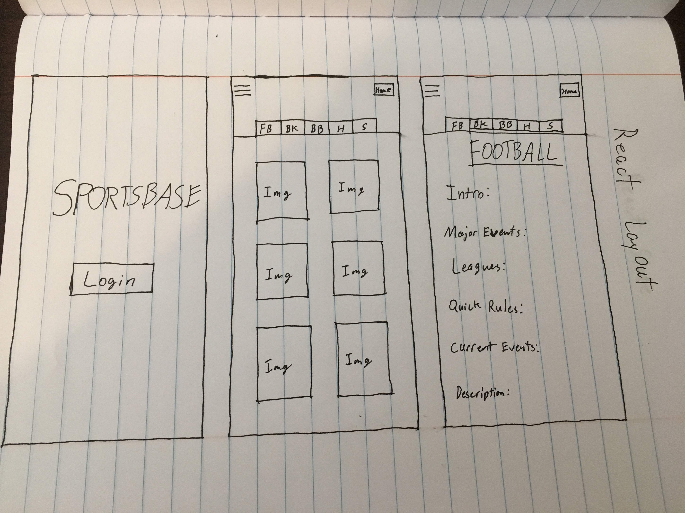

# React-Week-Three (Capstone pt.1)

This is a rough draft of a sports companion app made as a Capstone project in the Epicodus curriculum. This was made with React with the intention of it looking similar to the final product, but without the functionality of lifting state or calling an API.


### Component Tree


## Getting Started

These instructions will get you a copy of the project up and running on your local machine.

### Set Up

To set the project up:

First clone this repository by copying this link.

```
  https://github.com/Maxna/Capstone-Project-Plan.git

```

Then open the terminal and navigate the the desktop. Clone the project down by using the following command.

```
$ cd desktop
$ git clone https://github.com/Maxna/Capstone-Project-Plan.git
```

Next, in the terminal navigate to the project folder, and then open it with the Atom editor. Use these commands.

```
$ cd Capstone-Project-Plan
$ atom .
```

Then install the npm dependencies.

```
$ npm install
```

Finally, open the app in the web browser.

```
$ npm run start
```

This app is not interactive yet, Redux and an API are scheduled to come.

## User Story

* As a User I want to be able to browse a list of sports images
* As a User I want to be able to select a sport to learn more about it
* As a User I want to be able to return to the list of sports when I am finished with a particular sport

#### Project Layout Illustration



## Built With

* ReactJS
* HTML
* CSS
* JSX
* npmjs
* Atom
* Webpack
* Babel

## Notes

```
Component Name: 
ISSUE -  
SOLUTION - 

```

## Author

* **Matt Nardoni** -*Main Contributor*- [Capstone Draft](https://github.com/Capstone-Project-Plan)

## License

This project is licensed under the MIT License